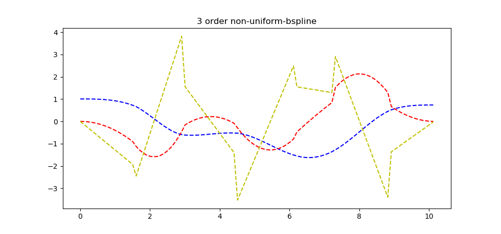

# General Non-Uniform Bspline Representation Library (libnbspline)

## Introduction
libnbspline is a header only library, several test examples are compiled using CMake. Libnbspline aims to provide a library that accepts non-uniform knot vector unlike uniform bsplines with a fixed knot interval.

| |
| :-: |
|[](3rd_order_nbspline.png)|

---

## Setup
```bash
git clone git@github.com:matthewoots/libnbspline.git --recurse-submodules
cd libnbspline
mkdir build && cd build
cmake .. 
make
```

---

## Run functionality check and brief of the algorithm and code
Run `./functionality` in the `build` folder to test the performance and speed without going through the ctest checks
```bash
# Time vector represents the ascending time vector (size = cp_size + order - 1)
# Control point vector is defined by a clamped vector (order*start_cp ... order*end_cp)
# Relationship is seen in test_functionality.cpp
time_vector = 0 1.60281 2.9517 4.48911 6.16895 7.25034 8.89521 10.15 12.1304 13.3458 14.9469 16.1748
control point vector = 1.00648 1.00648 1.00648 -0.999566 -0.158286 -1.81372 -1.50363 0.736339 0.736339 0.736339
# We only need to evaluate till time_vector[(cp_size-1)-(order-1)], this is the end time = Reason is that the last few values are quite redundant but will be used to evaluate the spline (for the last segment)

# Query whether the time point is within the given time vector and to find the relevant time vector (trimmed) and also the control points that are needed to evaluate the spline
check_query_time 0.000366ms
time_trim vector test 0 1.60281 2.9517 4.48911 6.16895 7.25034

# General Basis matrix from the time vector (knots), this is special due to it being a non-uniform bspline and therefore the relationship is shown in page 4 of General Matrix Representation for Bsplines by Kaihuai Qin 
create_general_m 0.003404ms
 0.182422   0.67952  0.138058         0
-0.547267  0.075208  0.472059         0
 0.547267   -1.0853  0.538035         0
-0.182422  0.522663 -0.511149  0.170908

# Ending time = time_vector[(cp_size-1)-(order-1)]
total nbspline time: 10.15s
# And start the real time evaluation until end time
[7.5e-08] get_nbspline_1d 0.010785ms

...

# Using matplot via a 3rd party package to plot the results (position velocity and acceleration with respect to time)
plt::show();
```

---

## Include in other projects
To link this header only library, just `include the header file`, hence just add following in the desired `CMakeLists.txt`
```
include_directories( ...
    libnbspline/include)
```
