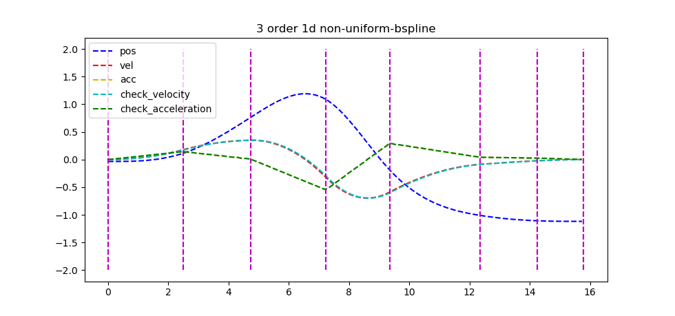
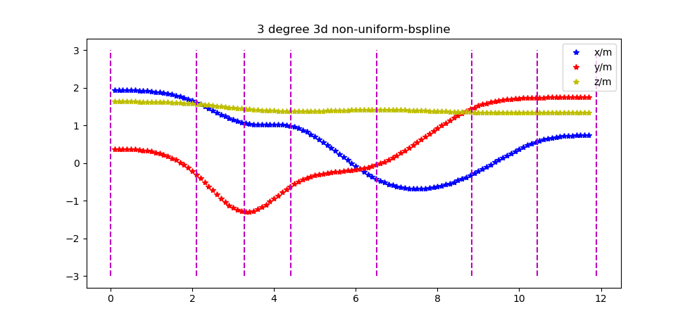

# General Non-Uniform Bspline Representation Library (libnbspline)

## Introduction
libnbspline is a header only library, several test examples are compiled using CMake. Libnbspline aims to provide a library that accepts non-uniform knot vector unlike uniform bsplines with a fixed knot interval.
- This library uses a mixed concepts from `General Matrix Representations for B-Splines` by `Kaihuai Qin` ([here](https://xiaoxingchen.github.io/2020/03/02/bspline_in_so3/general_matrix_representation_for_bsplines.pdf)) and `Real-Time Trajectory Replanning for MAVs using Uniform B-splines and a 3D Circular Buffer` by `Vladyslav Usenko` ([here](https://arxiv.org/pdf/1703.01416.pdf))
---

## Some insights

**Correction** of derivative equations in `Kaihuai Qin`'s implementation by `Vladyslav Usenko`

- **Position** is expressed as $$c_{k-1} = U^k M^k V^k$$
- `Original` **Velocity** is expressed as $$\frac{d}{du}c_{k-1} = \frac{dU^k}{du} M^k V^k$$
- `Corrected` **Velocity** is expressed as $$\frac{d}{du}c_{k-1} = \frac{1}{(u_{i+1} - u_i)} * \frac{dU^k}{du} M^k V^k$$
- `Original` **Acceleration** is expressed as $$\frac{d^2}{du^2}c_{k-1} = \frac{d^2U^k}{du^2} M^k V^k$$
- `Corrected` **Acceleration** is expressed as $$\frac{d^2}{du^2}c_{k-1} = (\frac{1}{(u_{i+1} - u_i)})^2 \frac{d^2U^k}{du^2} M^k V^k$$

**Input:** 
1. `control_points` in `double` or `Eigen::Vector3d` (size = user input)
2. `knots` in `vector<td::chrono::time_point<std::chrono::system_clock>>`(size = control point size + degree - 1)
    - control points + knots must be clamped together (with degree - 1 duplicate of start and end points)

**Output:**
1. `time_point` in `std::chrono::time_point<std::chrono::system_clock>`
2. `position` in `Eigen::Vector3d`
3. `velocity` in `Eigen::Vector3d`
4. `acceleration` in `Eigen::Vector3d`

**Useful functions:**

Functions with `get_nbspline_*_all` enables the user to input an interval to generate all points until `knots.back()` while `get_nbspline_*` enables the user to call the position in realtime.

1. get_nbspline_1d_all `vector<nbs_pva_state_1d> get_nbspline_1d_all(int degree, vector<t_p_sc> time, vector<double> cp, double interval, t_p_sc start)`
2. get_nbspline_1d `nbs_pva_state_1d get_nbspline_1d(int degree, vector<t_p_sc> time, vector<double> cp, t_p_sc query_time, t_p_sc start)`
3. get_nbspline_1d_w_prior `nbs_pva_state_1d get_nbspline_1d_w_prior(double dt, int time_index_offset, vector<double> cp, double u_t, Eigen::MatrixXd M, int k)`
4. get_nbspline_3d `nbs_pva_state_3d get_nbspline_3d(int degree, vector<t_p_sc> time, vector<Eigen::Vector3d> cp, t_p_sc query_time, t_p_sc start)`
5. get_nbspline_3d_all `vector<nbs_pva_state_3d> get_nbspline_3d_all(int degree, vector<t_p_sc> time, vector<Eigen::Vector3d> cp, double interval, t_p_sc start)`

---

| pos, vel and acc | 3d plot for position |
| :-: | :-: |
|[](media/3rd_degree_1d_nbspline.png)|[](media/3rd_degree_3d_nbspline.png)|

---

## Setup
```bash
git clone git@github.com:matthewoots/libnbspline.git --recurse-submodules
cd libnbspline
mkdir build && cd build
cmake .. 
make
```

---

## Run functionality check and brief of the algorithm and code
`ctest make` will run `functionality_1d` to show whether functionality for 1 dimension bspline is valid
- `<argv>` can be empty, `fast` or `faster`, fast skips the time pauses to complete the graph, while faster optimizes the calculation
- Run `./functionality_1d <argv>` in the `build` folder to test the performance for **1D** without going through the ctest checks
- Run `./functionality_3d <argv>` in the `build` folder to test the performance for **3D** and plots out the positions in the 3 axis
```bash
# Time vector represents the ascending time vector (size = cp_size)
# Control point vector is defined by a clamped vector ((degree-1)*start_cp ... (degree-1)*end_cp)
# Relationship is seen in test_functionality.cpp
time_vector = 0 1.60281 2.9517 4.48911 6.16895 7.25034 8.89521 10.15 12.1304 13.3458 14.9469 16.1748
control point vector = 1.00648 1.00648 1.00648 -0.999566 -0.158286 -1.81372 -1.50363 0.736339 0.736339 0.736339

# Query whether the time point is within the given time vector and to find the relevant time vector (trimmed) and also the control points that are needed to evaluate the spline
check_query_time 0.000366ms
time_trim vector test 0 1.60281 2.9517 4.48911 6.16895 7.25034

# General Basis matrix from the time vector (knots), this is special due to it being a non-uniform bspline and therefore the relationship is shown in page 4 of General Matrix Representation for Bsplines by Kaihuai Qin 
create_general_m 0.003404ms
 0.182422   0.67952  0.138058         0
-0.547267  0.075208  0.472059         0
 0.547267   -1.0853  0.538035         0
-0.182422  0.522663 -0.511149  0.170908

total nbspline time: 10.15s
# And start the real time evaluation until end time
[7.5e-08] get_nbspline_1d 0.010785ms

...

# Using matplot via a 3rd party package to plot the results (position velocity and acceleration with respect to time)
plt::show();
```

---

## Include in other projects
Just add following in the desired `CMakeLists.txt` add the `add_subdirectory` line and inside your `target_link_libraries` line
```
add_subdirectory(nbspline)
...
target_link_libraries(${NAME}
  ...
  nbspline
)
```
