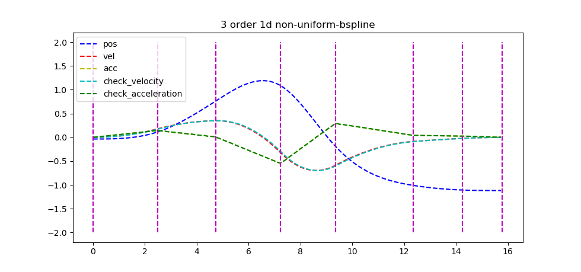

# Documentation for B-splines

## Some resources
- https://pages.mtu.edu/~shene/COURSES/cs3621/NOTES/spline/B-spline/bspline-basis.html
- https://xiaoxingchen.github.io/2020/03/02/bspline_in_so3/general_matrix_representation_for_bsplines.pdf
- https://arxiv.org/pdf/1703.01416.pdf

---

## Introduction
B-spline or Basis Spline, is a piecewise polynomial function of degree in a variable. The variables for B-splines are in the form of `knots` and `control points`.

We can define the knot vector $U$ to be an ascending vector of `time points` where in this implementation, we use `time_point<std::chrono::system_clock>`. (etc 0, 0.5, 1.0, 1.5, 2.0)

`Control points` in the simplest form would be a 1d points scattered across, hence the plot for B-spline would be in `x(m) - t(s)` domain

In piecewise form, 

| piecewise form | bspline variables |
| :-: | :-: |
|  |  |

---
## de-Boor Algorithm
It is a fast and numerically stable way for finding a point on a B-spline curve given a u in the domain, follow the notes from https://pages.mtu.edu/~shene/COURSES/cs3621/NOTES/spline/de-Boor.html if there are things you want to clarify

We can take a look at `MTU`'s course on Bsplines, the example given is a 3rd order B-spline curve defined by 
- 7 control points `p0, p1 ... p6` 
- 11 knots `u0 to u3 = 0, u4 = 0.25, u5 = 0.5, u6 = 0.75, u7 to u10 = 1`

And the example here is that we want to find `p(0.4)`, note that it lies between knots `u4` and `u5`

The notation here for the `de-Boor algorithm` is that in $P_{i,j}$ (points from the basis curve)
- $j$ represents the columns (we have to reduce the columns to 1 to find the final point)
- $i$ represents the points (after being altered when the degree is raised)

| Formulation | Example |
| :-: | :-: |
|  |  |

We would start with control points $P_{1,0}, P_{2,0}, P_{3,0}, P_{4,0}$

### From column 1 to 2:

We can find the points for `column 2` in the **figure above** using the equation below

$$
p_{4,1} = (1 - a_{4,1}) \ p_{3,0} + a_{4,1} \ p_{4,0} \\
p_{3,1} = (1 - a_{3,1}) \ p_{2,0} + a_{3,1} \ p_{3,0} \\
p_{2,1} = (1 - a_{2,1}) \ p_{1,0} + a_{2,1} \ p_{2,0}
$$

$$
a_{4,1} = \frac{u - u_4}{u_{4+3} - u_4} = 0.2 \\
a_{3,1} = \frac{u - u_3}{u_{3+3} - u_3} = 0.53 \\
a_{2,1} = \frac{u - u_2}{u_{2+3} - u_2} = 0.8 
$$

### From column 2 to 3:

We can find the points for `column 3` in the **figure above** using the equation below

$$
p_{4,2} = (1 - a_{4,2}) \ p_{3,1} + a_{4,2} \ p_{4,1} \\
p_{3,2} = (1 - a_{3,2}) \ p_{2,1} + a_{3,2} \ p_{3,1}
$$

$$
a_{4,2} = \frac{u - u_4}{u_{4+3-1} - u_4} = 0.3 \\
a_{3,2} = \frac{u - u_3}{u_{3+3-1} - u_3} = 0.8
$$

### From column 3 to 4:

We can find the points for `column 4` in the **figure above** using the equation below

$$
p_{4,3} = (1 - a_{4,3}) \ p_{3,2} + a_{4,3} \ p_{4,2}
$$

$$
a_{4,3} = \frac{u - u_4}{u_{4+3-2} - u_4} = 0.6
$$

### Summary
In short de-Boor algorithm substitute the weights from each piecewise curve using a recursive formulation to derive the point in time.

---

## General Representation

**Correction** of derivative equations in `Kaihuai Qin`'s implementation by `Vladyslav Usenko`

- **Position** is expressed as $$c_{k-1} = U^k M^k V^k$$
- `Original` **Velocity** is expressed as $$\frac{d}{du}c_{k-1} = \frac{dU^k}{du} M^k V^k$$
- `Corrected` **Velocity** is expressed as $$\frac{d}{du}c_{k-1} = \frac{1}{(u_{i+1} - u_i)} * \frac{dU^k}{du} M^k V^k$$
- `Original` **Acceleration** is expressed as $$\frac{d^2}{du^2}c_{k-1} = \frac{d^2U^k}{du^2} M^k V^k$$
- `Corrected` **Acceleration** is expressed as $$\frac{d^2}{du^2}c_{k-1} = (\frac{1}{(u_{i+1} - u_i)})^2 \frac{d^2U^k}{du^2} M^k V^k$$

---

| pos, vel and acc | 3d plot for position |
| :-: | :-: |
|||

---